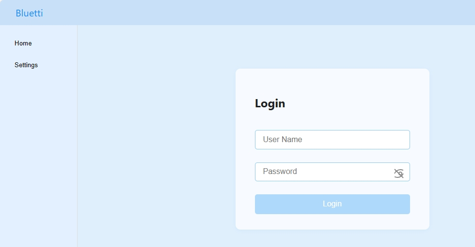
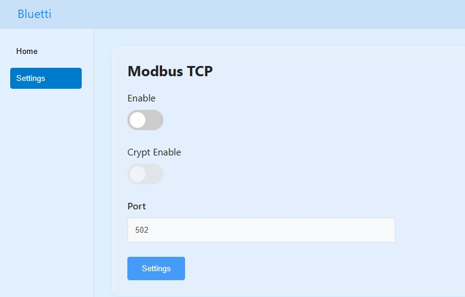

# 一.Enable Modbus TCP and Set the Port

1. Ensure the computer and the device are on the same LAN.

2. Open a browser, enter the device’s IP address, and access the local web page。

    The local web page is embedded in the device's internal web server, accessible via two methods:

    LAN access. The device IP is assigned by the customer's DHCP router.

    Access through the device's built-in Wi-Fi AP hotspot, with a fixed IP address of 192.168.8.1.

    The web server may be disabled by default per local network security regulations and requires manual activation.

    Due to limitations of IoT MCU resources and firmware versions, this function is only available for partial device models.

- Login

        The username is “admin”, and the password is the Bluetti APP password. If there is no password, leave the field blank.

        *Note: The device's IP address can be viewed on the network configuration page of the Bluetti APP.*

- Switch to the Settings→Modbus TCP page, turn on Enable, and set the Port to 502.

        Click the Settings button to save the configuration.

# 二.Connect to Modbus TCP

    The Bluetti device acts as a Modbus Slave, listening for external Modbus TCP connections and responding to Modbus commands.

    Therefore, a Modbus tool is required to act as the Modbus Master and actively connect to the device (Slave).

1. Establish a Modbus TCP Connection
   
   In the Modbus tool, set the connection IP address to the device’s IP address and the port to the Modbus TCP Port set on the local web page (502 in this example).

2. Read Device Data
   
   The device’s slave address is 1 by default. Use the Modbus register addresses provided in the table for reading data.

*Note: If a timeout occurs, try improving the LAN signal or increasing the Modbus timeout duration.*

        

    
